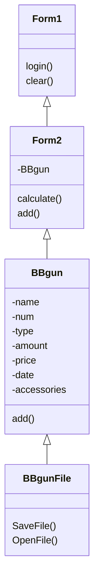

# Final_Project_643450076_9
Finalproject oop  
### วัตถุประสงค์ของโปรแกรม
ใช้ในการบันททึกและคำนวณข้อมูลเบื้ยงต้นในการเช่า ปืนBBgun  
### Class Diagram

```mermaid
classDiagram 
  Form2 <|-- BBgun
  Form1 <|-- Form2
  BBgun <|-- BBgunFile
class Form1{
  login()
  clear()
  }
class Form2{
  -BBgun
  calculate()
  add()
  }
class BBgun{
  -name
  -num
  -type
  -amount
  -price
  -date
  -accessories
  add()
}
class BBgunFile{
  SaveFile()
  OpenFile()
}
```
## นายธนาธิป เตชะ
